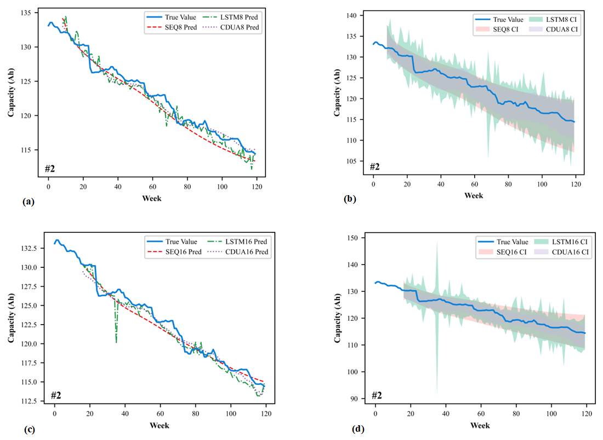

# 基于条件扩散模型的电池容量概率性预测

本仓库为论文《A Conditional Diffusion Model for Battery Capacity Probabilistic Prediction》的官方代码实现。该研究提出了一种名为 CDUA (Conditional Diffusion U-Net with Attention) 的新型深度学习框架，旨在精确预测锂离子电池的容量衰退过程，并对预测结果的不确定性进行量化。

我们的模型利用条件扩散过程生成电池容量的概率性预测。通过将特征工程与自注意力增强的 U-Net 架构相结合，CDUA 能够从少量真实电动汽车（EV）数据中高效捕捉复杂的时间序列依赖关系。

## 主要贡献

* **创新的概率性预测框架**: 本研究提出了一种新颖的预测框架，将电池容量预测视为一个条件去噪过程。这不仅能够提供高精度的点预测结果，还能对预测的不确定性进行量化评估 。
* **适用于小样本学习的注意力增强U-Net**: 模型核心是一个集成了自注意力机制的 U-Net 架构 。该设计能够从有限的真实车辆数据（本研究中为20辆车）中捕捉复杂的序列依赖和特征间的相关性，显著提升了模型在小样本场景下的泛化能力。
* **混合特征工程框架**: 建立了一个通用的特征工程框架，结合了统计分析（皮尔逊相关系数）和机器学习方法（XGBoost）。该框架能高效地从真实车辆充电数据中筛选出对电池容量预测至关重要的核心特征，为模型的高精度预测奠定了坚实的数据基础 。
* **真实世界数据集验证**: 模型在包含20辆真实电动汽车的公开数据集上进行了全面验证，证明了其卓越的有效性和鲁棒性 。

## 性能亮点

与长短期记忆网络（LSTM）和 Seq2Seq 等主流基线模型相比，我们提出的 CDUA 模型在各项性能指标上均展现出显著优势。

* **卓越的预测精度**: 实现了约 0.94% 的相对平均绝对误差（MAE）和 1.14% 的相对均方根误差（RMSE）。
* **精确的不确定性量化**: 提供了宽度仅为 3.74% 的 95% 置信区间，远优于其他基线模型，同时保证了近93%的预测区间覆盖率。


*图：在2号车辆上，CDUA模型与基线模型的点预测及置信区间预测的可视化对比。分别展示了基于8周和16周历史数据的预测结果。*

## 数据集

本研究采用了一个公开的真实世界数据集，其中包含了20辆配备相同电池系统的电动汽车在120周运营期内的充电数据。数据通过控制器局域网（CAN）在充电过程中采集得到。

* **数据来源**: Deng, Z., Xu, L., Liu, H., Hu, X., Duan, Z., & Xu, Y. (2023). Prognostics of battery capacity based on charging data and data-driven methods for on-road vehicles. Applied Energy, 339, 120954. 

## 环境安装

1.  **创建并激活新的 Conda 环境：**
    ```bash
    conda create -n cdua_env python=3.9
    conda activate cdua_env
    ```

2.  **安装支持 CUDA 的 PyTorch：**
    
    ```bash
    pip install torch torchvision torchaudio --index-url [https://download.pytorch.org/whl/cu118](https://download.pytorch.org/whl/cu118)
    ```

3.  **安装所需的依赖包：**
    
    ```bash
    pip install -r requirements.txt
    ```

## 使用方法

实验脚本设计用于不同长度的历史输入序列（8、16、24 和 32 周）。您可以使用以下命令来运行我们提出的 CDUA 模型以及基线模型的训练和评估。

`nohup` 命令用于在后台运行进程，并将输出日志重定向到文件。

### CDUA (本文模型)

* **8 周输入：**
    ```bash
    nohup python ./cdua8.py > 8.log 2>&1 &
    ```
* **16 周输入：**
    ```bash
    nohup python ./cdua.py > 16.log 2>&1 &
    ```
* **24 周输入：**
    ```bash
    nohup python ./cdua24.py > 24.log 2>&1 &
    ```
* **32 周输入：**
    ```bash
    nohup python ./cdua32.py > 32.log 2>&1 &
    ```

### Seq2Seq (基线模型)

* **8 周输入：**
    ```bash
    nohup python ./seq8.py > 8.log 2>&1 &
    ```
* **16 周输入：**
    ```bash
    nohup python ./seq16.py > 16.log 2>&1 &
    ```
* **24 周输入：**
    ```bash
    nohup python ./seq24.py > 24.log 2>&1 &
    ```
* **32 周输入：**
    ```bash
    nohup python ./seq32.py > 32.log 2>&1 &
    ```

### LSTM (基线模型)

* **8 周输入：**
    ```bash
    nohup python ./lstm8.py > 8.log 2>&1 &
    ```
* **16 周输入：**
    ```bash
    nohup python ./lstm16.py > 16.log 2>&1 &
    ```
* **24 周输入：**
    ```bash
    nohup python ./lstm24.py > 24.log 2>&1 &
    ```
* **32 周输入：**
    ```bash
    nohup python ./lstm32.py > 32.log 2>&1 &
    ```

## 引用

如果您在您的研究中使用了本项工作，请考虑引用我们的论文：

```bibtex
@article{li2025conditional,
  title={A Conditional Diffusion Model for Battery Capacity Probabilistic Prediction},
  author={Li, Hequn and Deng, Zhongwei and He, Yuxin and Jiang, Chunlin},
  journal={Journal Title}, % 发表后更新
  year={2025} % 发表后更新
}
